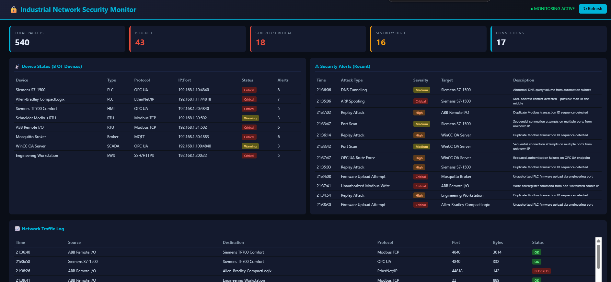
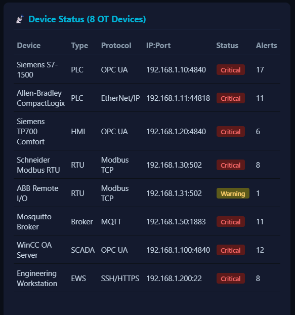
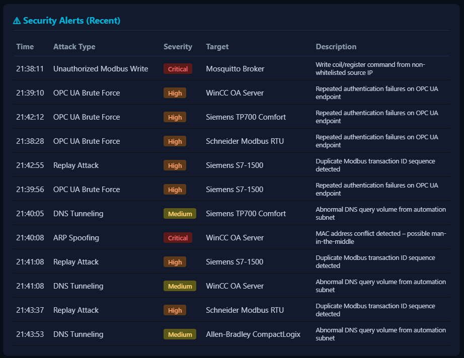
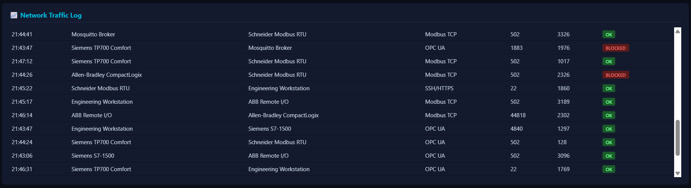

# 🔒 Industrial Network Security Monitor
 

 
## Overview
Full-stack web dashboard monitoring a simulated industrial OT network
for cybersecurity threats. 8 devices, 5 industrial protocols, 8 attack types.
 
## 🔗 Live Demo
**[Open Monitor](https://industrial-network-monitor.onrender.com)**
 
## Features
| Feature | Details |
|---------|---------|
| Devices | 8 (Siemens S7, Allen-Bradley, Schneider, ABB, Mosquitto, WinCC) |
| Protocols | OPC UA, Modbus TCP, MQTT, EtherNet/IP, SSH/HTTPS |
| Attack Types | 8 (Port Scan, Modbus Write, Brute Force, ARP Spoof, etc.) |
| Severity Levels | Critical (red), High (orange), Medium (yellow) |
| Auto-Refresh | Every 5 seconds |
| Tech Stack | **Flask + HTML/CSS/JavaScript** (full-stack, NOT Streamlit) |
| Deploy | **Render.com** (free tier, auto-deploys from GitHub) |
 
## Device Status

 
## Security Alerts

## Network Traffic

 
## Industrial Protocols Covered
- **OPC UA** (port 4840) — Siemens S7-1500, HMI, WinCC SCADA
- **Modbus TCP** (port 502) — Schneider RTU, ABB Remote I/O
- **MQTT** (port 1883) — Mosquitto Broker
- **EtherNet/IP** (port 44818) — Allen-Bradley CompactLogix
- **SSH/HTTPS** (port 22) — Engineering Workstation

 
## Author
**Oscar Vincent Dbritto**
